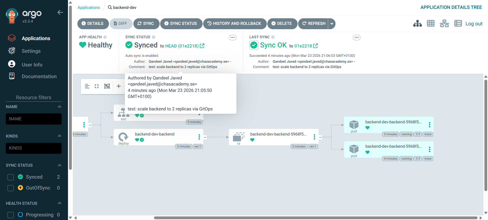
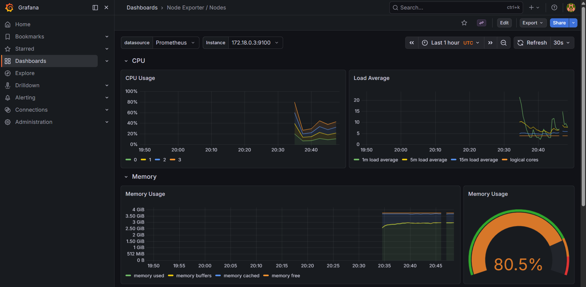
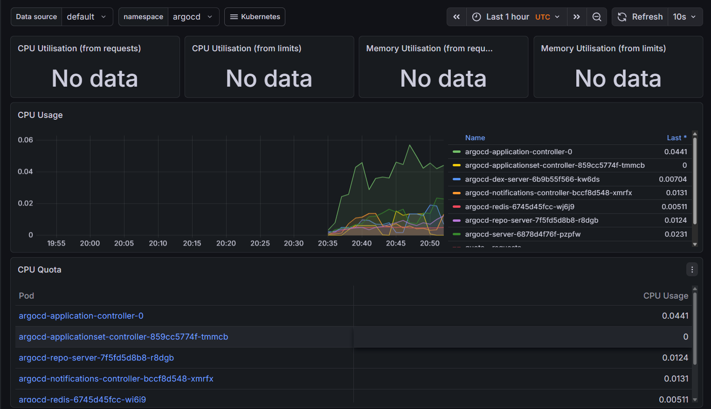

# GitOps Platform on Kubernetes

A production-style GitOps platform I built to learn and demonstrate modern DevOps practices.
The idea is simple: **Git is the only source of truth**. You push code, everything else happens automatically.

No manual `kubectl apply`. No manual `helm install`. Just git.

---

## What it does

When I push a change to this repo:

1. **GitHub Actions** picks it up, builds a new Docker image and pushes it to GHCR
2. ArgoCD Image Updater detects the new image in GHCR and updates the cluster automatically
3. **ArgoCD** detects that git changed and automatically syncs the cluster
4. New pods roll out — zero manual steps

If someone manually changes something directly in the cluster, ArgoCD detects the drift
and self-heals it back to what's in git within minutes.

---

## Stack

| Layer | Tool | Why |
|---|---|---|
| Cluster | Kubernetes (k3s via k3d) | Lightweight, runs locally for free |
| Packaging | Helm | Templated, versioned K8s manifests |
| GitOps engine | ArgoCD | Automated sync from git to cluster |
| CI pipeline | GitHub Actions | Build, tag, push, and commit on every push |
| Registry | GHCR | Free container registry, built into GitHub |
| Metrics | Prometheus | Scrapes all cluster and pod metrics |
| Dashboards | Grafana | Pre-built K8s dashboards + custom alerts |
| Alerts | Alertmanager | Routes alerts for pod crashes, node issues |
| Image Updater | ArgoCD Image Updater | Auto-detects new images in GHCR, no CI commit needed |
| Frontend | Nginx | Serves HTML dashboard, proxies API calls to backend |

---

## Project layout
```
gitops-platform/
├── apps/
│   └── backend/          # Flask API - the app being deployed
│       ├── app.py
│       ├── Dockerfile
│       └── requirements.txt
│   └── frontend/         # Nginx HTML dashboard
│       ├── index.html
│       ├── nginx.conf
│       └── Dockerfile
├── helm/
│   └── backend/          # Backend Helm chart - deployment + service templates
│   │    ├── Chart.yaml
│   │    ├── values.yaml
│   │    ├── values-prod.yaml
│   │    └── templates/
│   └── frontend/         # Frontend Helm chart
│       ├── Chart.yaml
│       ├── values.yaml
│       └── templates/
├── argocd/
│   └── applications/     # ArgoCD Application manifests
│       ├── backend-dev.yaml
│       ├── backend-prod.yaml
│       ├── frontend-dev.yaml
│       └── image-updater-backend.yaml
└── .github/
    └── workflows/
        └── ci.yaml       # Builds backend and frontend images
```

---

## How the GitOps loop works
```
Push code
    │
    ▼
GitHub Actions builds Docker image
    │
    ▼
Image pushed to GHCR with git SHA tag
    │
    ▼
ArgoCD Image Updater detects new image in GHCR
    │
    ▼
ArgoCD syncs cluster automatically
    │
    ▼
New pods running — zero manual steps
```

---

## ArgoCD — GitOps in action

The screenshot below shows ArgoCD after a git push scaled the backend from 1 to 2 replicas.
The commit message is visible — ArgoCD knows exactly which git commit it deployed.



- **App Health: Healthy** — all pods passing liveness + readiness probes
- **Sync Status: Synced to HEAD** — cluster matches git exactly
- **Auto sync is enabled** — no manual trigger needed

---

## Grafana — full observability

Node-level metrics (CPU, memory, disk, network) collected by Prometheus
and visualised in Grafana using the pre-built Node Exporter dashboard.



Memory sitting at **80.5%** — expected on a 3.8GB WSL2 machine running a full K8s stack.

Pod-level CPU and memory broken down per component across namespaces:



---

## Secrets management

No secrets are committed to this repo. Ever.

- Local development credentials live in `~/.devops-secrets/` — permission-locked, gitignored globally
- CI secrets (GHCR token) are stored as GitHub repository secrets
- The `GITHUB_TOKEN` built into Actions handles repo write access for the CI commit-back step

---

## Running it locally

**Prerequisites:** Docker, kubectl, helm, k3d, k9s
```bash
# 1 — Create the cluster
k3d cluster create gitops-cluster \
  --servers 1 --agents 1 \
  -p "8080:80@loadbalancer" \
  -p "8443:443@loadbalancer"

# 2 — Install ArgoCD
kubectl create namespace argocd
kubectl apply -n argocd \
  -f https://raw.githubusercontent.com/argoproj/argo-cd/stable/manifests/install.yaml

# 3 — Deploy the apps via GitOps
kubectl apply -f argocd/applications/

# 4 — Install monitoring
helm repo add prometheus-community \
  https://prometheus-community.github.io/helm-charts
helm install monitoring prometheus-community/kube-prometheus-stack \
  --namespace monitoring --create-namespace \
  --set grafana.adminPassword=admin123

# 5 — Access everything
kubectl port-forward svc/argocd-server -n argocd 9090:443 &
kubectl port-forward svc/monitoring-grafana -n monitoring 3000:80 &
```

| Service | URL | Credentials |
|---|---|---|
| ArgoCD | https://localhost:9090 | admin / (get from secret) |
| Grafana | http://localhost:3000 | admin / admin123 |
| Backend dev | http://backend.local:8080 | — |
| Backend prod | http://backend-prod.local:8080 | — |
| Frontend | http://frontend.local:8080 | — |

---

## What I learned

- How GitOps fundamentally changes the deployment model — the cluster pulls from git rather than being pushed to
- Writing Helm charts from scratch rather than using pre-built ones
- How ArgoCD self-healing works in practice — it genuinely reverses manual cluster changes
- Setting up a full observability stack and understanding what each component does (scraping, storage, visualisation, alerting are separate concerns)
- Why secrets management matters and how to handle it at each layer (local, CI, cluster)
- How ArgoCD Image Updater eliminates the need for CI to commit image tags back to git — separating build concerns from deployment concerns
- Deploying a multi-service architecture with a frontend proxying API calls to a backend through Nginx — and debugging real failures like missing imagePullSecrets and wrong YAML indentation
---

## Ingress

The backend is exposed via Traefik ingress controller. Add this to your `/etc/hosts`:
```
127.0.0.1 backend.local
127.0.0.1 backend-prod.local
127.0.0.1 frontend.local
```

Then access directly without port-forwarding:

| Endpoint | URL |
|---|---|
| Health check | http://backend.local:8080/health |
| API root | http://backend.local:8080/ |
| Items | http://backend.local:8080/items |
